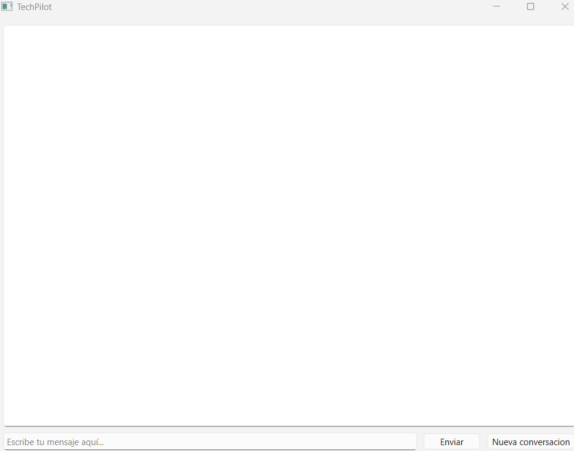

# TechPilot - AI sales Copilot for Consultative Techonology Sales" 

Desktop AI assistant for consultative technology sales. It combines a Large Language Model (LLM), Retrieval-Augmented Generation (RAG), and persistent conversation memory to provide contextual product recommendations and sales guidance.

**Built with:** Python · PyQt6 · Anthropic Claude API · LangChain · ChromaDB

## Demo




## Architecture 

The application follows a modular architecture where each component has a single responsibility.

```mermaid
flowchart TD

    A[User]

    A --> B[PyQt Desktop Interface]

    B --> C[TechPilot Engine]

    C --> D[RAG Retriever]

    D --> E[Anthropic Claude API]

    E --> F[Streaming Response]

    F --> B

    B -. Load / Save .-> G[Conversation History (JSON)]
```


## features

- Rea.-time streaming AI responses
- Retrieval-Augmented Generation (RAG)
- Persistent conversation history 
- AI - assisted consultative sales guidance
- Context-aware product recommendations
- Technical and commercial sales arguments 
- One-click new conversation 

--- 

## Tech stack

- Python 
- PyQt6
- Anthropic Claude API
- LangChain
- ChromaDB
- Sentence Transformers
- Dotenv 

## Installation 

1. Clone the repository

```bash
git clone https://github.com/your-username/TechPilot.git
cd TechPilot
```

2. Create and activate a virtual environment

```bash
python -m venv .venv

# Windows
.venv\Scripts\activate


3. Install the dependencies

```bash
pip install -r requirements.txt
```

4. Configure your environment variables

Rename `.env.example` to `.env` and add your Anthropic API key:

```env
ANTHROPIC_API_KEY=your_api_key
```

5. Run the application

```bash
python main.py
```

## Project Structure

```text
TechPilot/
├── core/
│   ├── claude.py
│   ├── rag.py
│   └── memoria.py
├── ui/
│   └── ventana.py
├── data/
│   └── catalogo.txt
├── main.py
├── requirements.txt
└── .env.example
```

## Autor

Alan — AI Engineer Jr